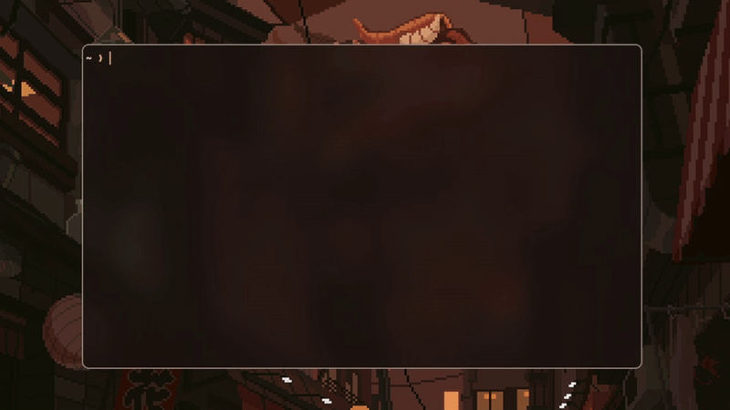

# oneliner

> Generate shell one-liners from natural language using LLMs

A smart CLI tool that translates your intent into precise shell commands. No more searching Stack Overflow for that perfect one-liner.



## Features

- 🤖 **Multiple LLM providers** - OpenAI, Claude, or your own local LLM
- 🎨 **Beautiful terminal UI** - Styled output with lipgloss and spinner animations
- 🛡️ **Smart safety checks** - Advanced risk assessment for destructive operations
- ⚡ **Fast execution** - Optional command execution with `--execute` flag
- 📋 **Clipboard integration** - Copy commands directly with `--clipboard`
- 📚 **Explain mode** - Get detailed explanations of what commands do
- 🧠 **Context-aware** - Considers your OS, shell, directory, and user
- 💾 **Intelligent caching** - Stores generated commands for instant reuse
- 🐚 **Multi-shell support** - Bash, Zsh, Fish, PowerShell

## Installation

### Prerequisites

- Go 1.25.1 or higher
- An API key from OpenAI or Anthropic (or a local LLM endpoint)

### From Source

```bash
# Clone the repository
git clone https://github.com/dorochadev/oneliner.git
cd oneliner

# Download dependencies
go mod download

# Build the binary
go build -o oneliner .

# Install to your PATH
sudo mv oneliner /usr/local/bin/
```

## Quick Start

1. **Run oneliner for the first time** - A default config will be created at `~/.config/oneliner/config.json`

2. **Add your API key:**

```bash
nano ~/.config/oneliner/config.json
```

For OpenAI:
```json
{
  "llm_api": "openai",
  "api_key": "sk-...",
  "model": "gpt-4.1-nano"
}
```

For Claude:
```json
{
  "llm_api": "claude",
  "api_key": "sk-ant-...",
  "model": "claude-sonnet-4-20250514",
  "claude_max_tokens": 1024
}
```

3. **Generate your first command:**

```bash
oneliner "find all jpg files larger than 10MB"
```

## Usage

### Basic Command Generation

```bash
oneliner "your query here"
```

The command is displayed for review but not executed by default.

### Available Flags

| Flag | Short | Description |
|------|-------|-------------|
| `--execute` | `-e` | Execute the generated command immediately |
| `--sudo` | | Prepend `sudo` to the command (Unix/Linux only) |
| `--explain` | | Show a detailed explanation of the command |
| `--clipboard` | `-c` | Copy the command to clipboard |
| `--config` | | Use a custom config file path |

### Examples

**Generate and review:**
```bash
oneliner "compress all log files in current directory"
```

**Execute immediately:**
```bash
oneliner -e "list all processes using port 8080"
```

**Execute with sudo:**
```bash
oneliner -e --sudo "update all system packages"
```

**Get an explanation:**
```bash
oneliner --explain "find files modified in last 24 hours"
```

**Copy to clipboard:**
```bash
oneliner -c "convert all png to jpg with imagemagick"
```

## Configuration

### Config File Location

- Default: `~/.config/oneliner/config.json`
- Custom: Use `--config /path/to/config.json`

### Configuration Options

```json
{
  "llm_api": "openai",
  "api_key": "your-api-key",
  "model": "gpt-4.1-nano",
  "default_shell": "bash",
  "local_llm_endpoint": "http://localhost:8000/v1/completions",
  "claude_max_tokens": 1024,
  "request_timeout": 60,
  "client_timeout": 65
}
```

| Option | Description | Default |
|--------|-------------|---------|
| `llm_api` | API provider: `openai`, `claude`, or `local` | `openai` |
| `api_key` | Your API key (OpenAI or Claude) | `""` |
| `model` | Model to use | `gpt-4.1-nano` |
| `default_shell` | Target shell: `bash`, `zsh`, `fish`, `powershell` | `bash` |
| `local_llm_endpoint` | URL for local LLM API | `http://localhost:8000/v1/completions` |
| `claude_max_tokens` | Max tokens for Claude responses | `1024` |
| `request_timeout` | Request timeout in seconds | `60` |
| `client_timeout` | Client timeout in seconds | `65` |

### Using a Local LLM

```json
{
  "llm_api": "local",
  "local_llm_endpoint": "http://localhost:8000/v1/completions",
  "model": "your-model-name"
}
```

Your local LLM should provide a `/v1/completions` endpoint compatible with the following format:

**Request:**
```json
{
  "model": "model-name",
  "prompt": "the full prompt"
}
```

**Response:**
```json
{
  "result": "generated command"
}
```

## How It Works

1. **Context Gathering** - Collects your OS, shell, current directory, and username
2. **Cache Check** - Looks for a cached response for identical queries
3. **Prompt Building** - Constructs a detailed prompt with system context
4. **LLM Generation** - Sends request to configured LLM provider
5. **Response Parsing** - Extracts command and optional explanation
6. **Risk Assessment** - Analyzes the command for potential dangers
7. **User Confirmation** - Prompts for confirmation if executing risky commands
8. **Execution** - Runs the command in the appropriate shell (if `--execute` is used)

## Smart Safety Features

Oneliner includes comprehensive risk assessment that detects:

- **Obfuscation techniques** - hex encoding, base64, eval/exec
- **Privilege escalation** - sudo, su, doas, pkexec (unless intentional with `--sudo`)
- **Destructive file operations** - rm -rf, find -delete, shred
- **Disk operations** - dd, mkfs, fdisk, partition tools
- **System file modifications** - /etc/passwd, /etc/shadow, /etc/sudoers
- **Network operations** - piping downloads to shell, netcat command execution
- **Resource exhaustion** - fork bombs, infinite loops
- **Data exfiltration** - network uploads, remote copies

When risks are detected, you'll see a detailed warning and confirmation prompt before execution.

## Caching

Generated commands are automatically cached based on:
- Your query
- Operating system
- Current working directory
- Username
- Shell
- Whether explanation was requested

Cache location: `~/.cache/oneliner/commands.json` (or set `ONELINER_CACHE_PATH` env variable)

## Command Examples

### File Operations
```bash
oneliner "find all files larger than 100MB"
oneliner "recursively delete empty directories"
oneliner "rename all files to lowercase in current directory"
oneliner "find duplicate files by md5 hash"
```

### System Administration
```bash
oneliner "check disk usage of all mounted filesystems"
oneliner "list all processes using more than 1GB of ram"
oneliner "show which service is using port 3000"
oneliner "monitor cpu usage in real-time"
```

### Text Processing
```bash
oneliner "count unique ip addresses in access.log"
oneliner "extract all email addresses from file.txt"
oneliner "replace all tabs with spaces in python files"
oneliner "find all TODO comments in source code"
```

### Network & Web
```bash
oneliner "test if google.com is reachable"
oneliner "download all pdfs from a webpage"
oneliner "show all listening tcp ports"
oneliner "curl with custom headers and post data"
```

### Git Operations
```bash
oneliner "show git commits from last week"
oneliner "delete all merged branches"
oneliner "find largest files in git history"
```

### Media Processing
```bash
oneliner "convert all mov files to mp4"
oneliner "resize all images to 1920x1080"
oneliner "extract audio from video.mp4"
```

## Environment Variables

- `ONELINER_CACHE_PATH` - Override default cache location
- `SHELL` - Detected automatically but can be overridden

## Security Best Practices

1. **Review before execution** - Always check generated commands before using `--execute`
2. **Use `--explain`** - Understand what a command does before running it
3. **Protect your config** - Config file is created with 0600 permissions
4. **Be cautious with --sudo** - Only use when necessary and review the command
5. **Trust the risk assessment** - If warnings appear, take them seriously
6. **Cache considerations** - Cached commands are reused for identical contexts

## Troubleshooting

### Command not found
Ensure the binary is in your PATH or use the full path to the executable.

### API errors
- Verify your API key is correct
- Check that you have API credits/quota remaining
- Ensure your network can reach the API endpoints

### Local LLM not working
- Verify the endpoint URL is correct
- Check that your local LLM server is running
- Ensure the response format matches the expected structure

### Cache issues
Delete the cache file to reset:
```bash
rm ~/.cache/oneliner/commands.json
```

## Contributing

Contributions are welcome, Please feel free to submit a Pull Request.

## License

MIT

## Acknowledgments

Built with:
- [Cobra](https://github.com/spf13/cobra) - CLI framework
- [Bubble Tea](https://github.com/charmbracelet/bubbletea) - TUI framework
- [Lipgloss](https://github.com/charmbracelet/lipgloss) - Terminal styling
- [Spinner](https://github.com/briandowns/spinner) - Loading animations

## Author

[@dorochadev](https://github.com/dorochadev)